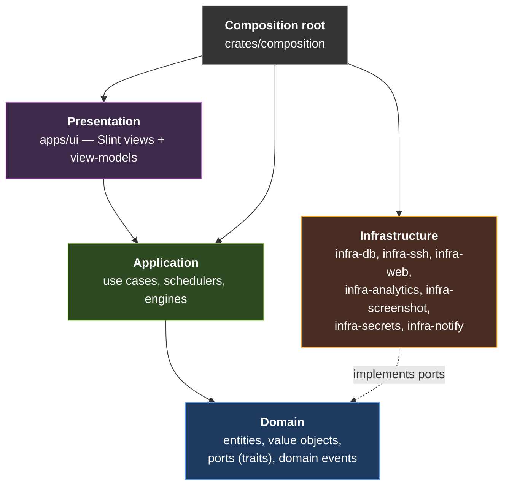
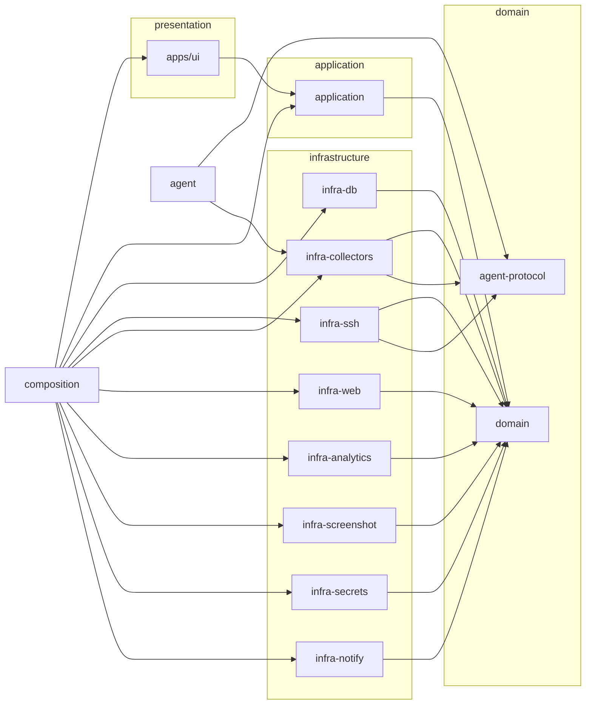
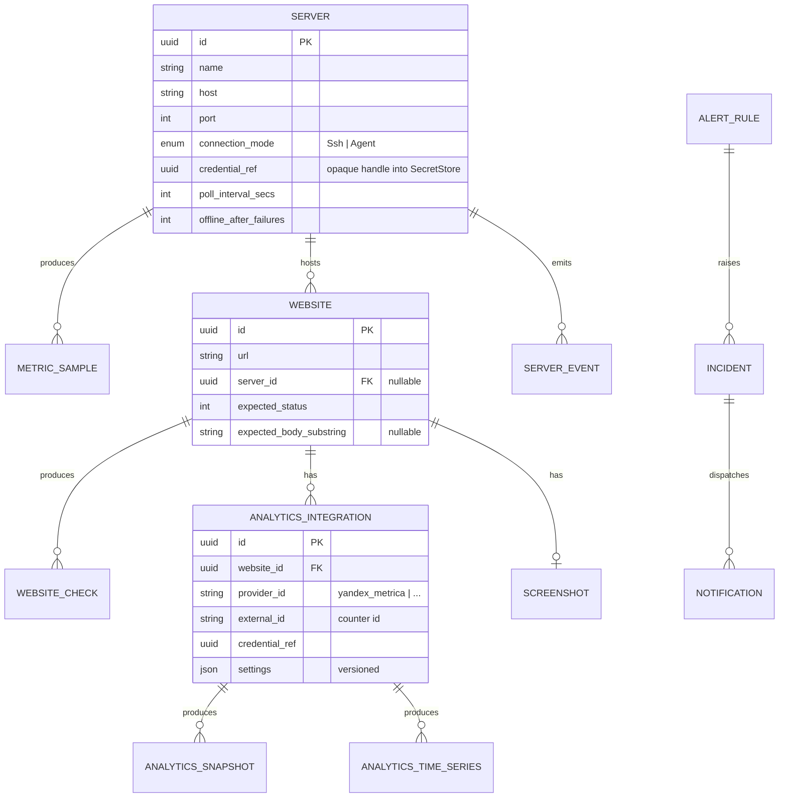
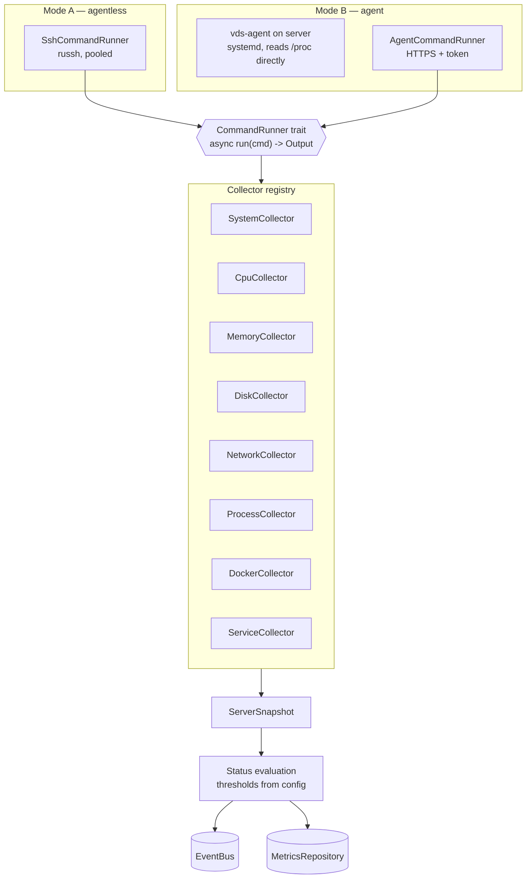
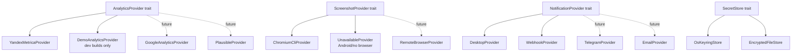
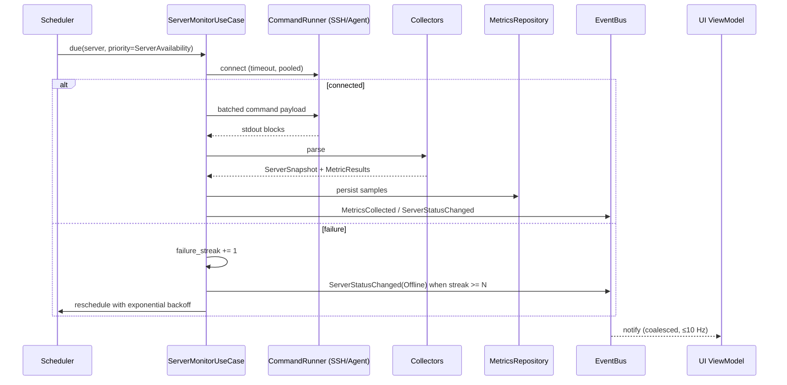
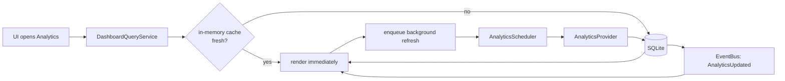

# VDS Admin — Architecture

> Единый кроссплатформенный центр мониторинга инфраструктуры, серверов, сайтов и веб-аналитики.

This document is the authoritative description of the system's structure. Individual
decisions and their alternatives are recorded separately in [`docs/adr/`](adr/).

---

## 1. Technology stack

**Chosen stack: pure Rust workspace + [Slint](https://slint.dev) for the GUI.**

The decision is recorded in [ADR-001](adr/001-technology-stack.md). Summary of the
reasoning:

The requested platform matrix is the deciding constraint. It includes **Windows x86
(32-bit)**, **Linux x86 (32-bit)** and **Linux ARMv7**. Flutter supports none of those
three as desktop targets (Flutter desktop is Windows x64/arm64, Linux x64/arm64 only),
so a Flutter-based UI cannot satisfy the matrix with a single codebase — it would force
a second, different application for the 32-bit and ARMv7 desktops, which the brief
explicitly forbids. Tauri inherits a system WebView dependency (WebKitGTK on Linux),
which makes ARMv7/x86 cross-compilation painful and conflicts with the "minimal resource
usage" goal.

Slint compiles to a native binary for **every** target the Rust compiler supports,
renders with its own software/GPU renderer (no WebView, no platform toolkit
dependency), starts in milliseconds, and idles in single-digit megabytes of RAM. Because
the UI and the monitoring core are the same language and the same Cargo workspace,
cross-compilation for the entire matrix is `cargo build --target <triple>` plus a linker,
and the *whole* application — including UI view-models — is covered by `cargo test`.

| Requirement | Rust + Slint | Flutter + Rust | Rust + Tauri | Go + Fyne |
|---|---|---|---|---|
| Windows x64 / ARM64 | ✅ | ✅ | ✅ | ✅ |
| Windows **x86 (32-bit)** | ✅ | ❌ | ✅ | ✅ |
| Linux x64 / ARM64 | ✅ | ✅ | ✅ | ✅ |
| Linux **x86 / ARMv7** | ✅ | ❌ | ⚠️ hard | ✅ |
| macOS x64 / ARM64 | ✅ | ✅ | ✅ | ✅ |
| Android (4 ABIs) | ✅ | ✅ | ✅ | ⚠️ |
| iOS | ⚠️ experimental | ✅ | ✅ | ⚠️ |
| Single language / toolchain | ✅ | ❌ two | ❌ two | ✅ |
| Cross-compile difficulty | low | high | high | low |
| Idle RAM | very low | medium | high | medium |
| Modern GUI quality | good | excellent | excellent | fair |

**Honest trade-offs of the choice:**

* **iOS** is Slint's weakest platform (experimental). The brief made iOS conditional
  ("if the framework allows"). The domain/application/infrastructure crates are 100%
  portable, so if iOS becomes a hard requirement only `apps/ui` would be replaced.
* **Charts** are not provided by Slint; they are drawn by this project in
  `apps/ui/ui/components/charts.slint` from pre-computed polyline geometry. The
  view-model does the maths in Rust (and it is unit-tested), the `.slint` file only
  draws paths.
* Slint's design language is less "batteries-included" than a web frontend, so the
  admin-panel look is built explicitly in `apps/ui/ui/theme.slint`.

**Key library choices** (all selected for cross-compilation friendliness — *no OpenSSL,
no system C dependencies beyond libc*):

| Concern | Crate | Why |
|---|---|---|
| Async runtime | `tokio` | de-facto standard, works on Android |
| SSH | `russh` | pure Rust; `libssh2`/OpenSSL would break ARM/Android cross-builds |
| HTTP | `reqwest` + `rustls` | pure Rust TLS, gives access to the peer certificate chain |
| TLS certificate parsing | `x509-parser` | pure Rust, no OpenSSL |
| Database | `rusqlite` (`bundled`) | SQLite compiled from source ⇒ cross-compiles everywhere, incl. Android |
| Secrets | `keyring` + `chacha20poly1305`/`argon2` | OS keystore first, encrypted file as fallback |
| Logging | `tracing` + `tracing-subscriber` + `tracing-appender` | structured, level-filtered, rotating |

---

## 2. Layered architecture

Dependencies point **inwards**. The domain knows nothing about SQL, SSH, HTTP, Slint or
Yandex.



The rule is enforced mechanically: `crates/domain/Cargo.toml` has no dependency on any
I/O crate, and CI runs `cargo tree` assertions (`scripts/check-layering.sh`) that fail
the build if `domain` ever gains a dependency on `rusqlite`, `russh`, `reqwest` or
`slint`.

### Crate map



`infra-collectors` is deliberately shared between the GUI application (which runs
collectors over an SSH transport) and the standalone `agent` (which runs the *same*
collectors over a local-shell transport). One parser, two transports — see §5.

---

## 3. Module boundaries

```
crates/domain/src/
├── server/          Server, ServerId, ConnectionMode, Credentials reference
├── website/         Website, WebsiteCheck, SslInfo, HttpExpectation
├── analytics/       AnalyticsSnapshot, AnalyticsTimeSeries, AnalyticsCapabilities
├── metrics/         MetricKind, MetricSample, MetricResult<T>, Rollup, Interval
├── alerts/          AlertRule, Condition, AlertState, Incident
├── events/          DomainEvent, EventEnvelope
├── status.rs        Status { Healthy, Warning, Critical, Offline, Unknown }
└── ports/           every trait the outside world must implement

crates/application/src/
├── monitoring/      ServerMonitorUseCase, WebsiteMonitorUseCase, OfflineDetector
├── analytics/       RefreshAnalyticsUseCase, TrafficAnomalyDetector
├── screenshots/     ScreenshotService (cache policy + refresh)
├── metrics/         MetricsAggregationService, RetentionService
├── alerts/          AlertEngine, NotificationDispatcher
├── dashboard/       DashboardQueryService, widget registry
├── correlation/     CorrelationEngine (time-window correlation only, MVP)
├── scheduler/       Scheduler, Job, Priority, Backoff, RateLimitManager
└── config/          ConfigurationService, typed settings + validation + migration
```

Rules that keep this from rotting:

* No `utils/`, `helpers/`, `common/` or `services/` catch-all modules anywhere.
* Every module owns one noun. If a file needs something from two modules, it belongs in
  the layer above, not in a shared bag.
* Infrastructure crates never depend on each other; they only depend on `domain`.

---

## 4. Domain model



The critical extensibility property: **there is no `yandex_*` table anywhere.** Analytics
is stored in `analytics_integrations` / `analytics_snapshots` / `analytics_time_series`,
keyed by a `provider_id` string, with provider-specific configuration confined to a
versioned `settings` JSON blob. Adding Google Analytics adds *rows*, not *columns*.

### Status model

A single `Status` enum is used by every subsystem, ordered by severity so that
aggregation is a `max()`:

```
Unknown < Healthy < Warning < Critical < Offline
```

Every collector returns `MetricResult<T> { status, value, timestamp, message }`. Status
*thresholds* live in configuration, not in collectors and never in the UI.

---

## 5. Monitoring architecture

Two acquisition modes share one parsing layer.



`CommandRunner` is the single seam. Because collectors only see *text in → struct out*,
each parser is a pure function that is unit-tested against captured real-world fixtures
(`crates/infra-collectors/tests/fixtures/`), and a `ScriptedCommandRunner` lets the test
suite emulate an online server, a slow server, a server without Docker, a broken
`systemctl`, and so on — without a network.

The agent embeds the same collectors but with a `LocalCommandRunner`, and additionally
reads `/proc` directly where that avoids spawning a shell at all (CPU, memory, load,
network, uptime), which is what keeps its footprint small.

### Offline detection

A server is `Offline` only after **N consecutive failed checks** (default 3,
configurable per server). A single timeout produces `Unknown`, not `Offline` — this
prevents alert storms from transient packet loss. State lives in
`application::monitoring::OfflineDetector` and is unit-tested.

---

## 6. Provider architecture

Every external integration is a provider behind a domain trait, and every provider
advertises **capabilities** so the UI can hide what a provider cannot do.



Every provider implements:

```rust
fn id(&self) -> ProviderId;
fn capabilities(&self) -> ProviderCapabilities;
async fn validate_connection(&self) -> Result<(), ProviderError>;
```

`ProviderRegistry<T>` holds `Arc<dyn T>` keyed by `ProviderId`. **Adding a provider is:
implement the trait, register it in the composition root, add a capability mapping, add
tests.** No existing module changes.

When a provider does not support a metric, the domain returns
`MetricValue::NotAvailable` — never a fabricated zero. The UI renders `—` and hides the
corresponding chart tab.

---

## 7. Data flow

### Monitoring cycle



### Read path — cache-aside / stale-while-revalidate



The UI **never** performs I/O. It reads immutable view-model snapshots and pushes intents
into the application layer. This is what makes the UI testable and keeps polling off the
render thread.

---

## 8. Database strategy

SQLite (via `rusqlite`, bundled build) in WAL mode. Access is wrapped in
`spawn_blocking` behind async repository traits, so swapping in PostgreSQL later means
writing a second implementation of the same traits — the application layer does not
change.

**Schema versioning.** Migrations are explicit, numbered, and applied inside a
transaction with `PRAGMA user_version` as the version marker. Nothing auto-alters tables
at startup. Before a migration that is not purely additive, the runner copies the
database file to `<db>.pre-v<N>.bak`.

**Time-series retention** — three tiers, all configurable:

| Tier | Table | Default retention | Produced by |
|---|---|---|---|
| raw | `metric_samples` | 7 days | collectors |
| 5-minute | `metric_rollups` (`bucket='m5'`) | 30 days | `MetricsAggregationService` |
| 1-hour | `metric_rollups` (`bucket='h1'`) | 365 days | `MetricsAggregationService` |
| 1-day | `metric_rollups` (`bucket='d1'`) | forever (configurable) | `MetricsAggregationService` |

Chart queries pick the tier from the requested window so the UI never receives more than
`MAX_CHART_POINTS` (750) regardless of range:

| Range | Tier | Points returned |
|---|---|---|
| 1 h | raw | ≤ 240 |
| 6 h, 24 h | `m5` | 72 / 288 |
| 7 d, 30 d | `h1` | 168 / 720 |
| 90 d, 1 y | `d1` | 90 / 365 |

---

## 9. Screenshot strategy

See [ADR-004](adr/004-screenshot-architecture.md). MVP provider drives a **locally
installed headless Chrome/Chromium via its CLI** (`--headless --screenshot`), discovered
at runtime across the usual install paths. Rationale: Playwright would introduce a
Node.js runtime and a ~150 MB browser download into a native app — unacceptable for an
Android APK and for ARM devices. The CLI approach has zero build-time dependencies, and
`RemoteBrowserProvider` (a screenshot service over HTTP) is the designed answer for
Android and for machines without a browser.

Capture never blocks the UI: `ScreenshotService` owns a low-priority scheduler queue with
a concurrency limit of 1–2. Results are stored as full PNG + a downscaled thumbnail
(`image` crate), with `captured_at` and a content hash. The UI **always** renders the
capture age next to a cached image, and shows explicit failure states rather than
silently reusing a stale capture.

---

## 10. Yandex Metrica strategy

`YandexMetricaProvider` implements `AnalyticsProvider` against the
[Reporting API](https://yandex.ru/dev/metrika/doc/api2/api_v1/intro.html)
(`https://api-metrika.yandex.net/stat/v1/data`), authenticating with an OAuth token
supplied by the user and stored **only** in the `SecretStore` (never in SQLite, never in
logs).

Metric mapping — the provider translates the domain's provider-independent metric names
into Metrica's, and reports the rest as `NotAvailable`:

| Domain metric | Metrica expression |
|---|---|
| `Visitors` | `ym:s:users` |
| `Visits` | `ym:s:visits` |
| `PageViews` | `ym:s:pageviews` |
| `NewVisitors` | `ym:s:newUsers` |
| `BounceRate` | `ym:s:bounceRate` |
| `AvgSessionDuration` | `ym:s:avgVisitDurationSeconds` |
| `PagesPerSession` | `ym:s:pageDepth` |
| `Sessions` | = `Visits` (Metrica has no separate concept) |
| `UniqueVisitors` | = `Visitors` |
| `ReturningVisitors` | derived: `Visitors − NewVisitors` |

Rate limiting is handled by a shared `RateLimitManager` (token bucket per provider +
per credential). On HTTP 429 / 5xx the scheduler backs off exponentially and the UI keeps
showing cached data with an "updated N minutes ago" label.

---

## 11. Scheduling and scale

One scheduler framework, no ad-hoc loops anywhere in the codebase.

```
Priority (highest first)
  1. CriticalAlert       — alert re-evaluation
  2. ServerAvailability  — reachability probes
  3. WebsiteAvailability — HTTP checks
  4. CoreMetrics         — CPU/RAM/disk collection
  5. Analytics           — provider refresh
  6. Screenshots         — browser capture
  7. Maintenance         — aggregation, retention, cleanup
```

Guarantees: bounded worker pool (never one-thread-per-server), global and per-kind
concurrency limits, per-job timeout, exponential backoff with jitter, request
deduplication by job key, cooperative cancellation via `CancellationToken`, graceful
shutdown.

Scaling targets:

| Fleet size | Strategy |
|---|---|
| ≤ 50 servers | SSH agentless, 15 s interval |
| ≤ 200 servers | SSH agentless, 30 s interval, connection reuse |
| ≤ 1000 servers | agent mode (push), SSH only as fallback |
| > 1000 servers | agent mode + optional central server (designed for, not in MVP) |

For 10 000+ websites the check queue is sharded by due-time and the UI list is virtualised
and paginated; nothing loads the full set into memory.

---

## 12. Event system

```rust
enum DomainEvent {
    ServerStatusChanged { .. },
    WebsiteStatusChanged { .. },
    MetricThresholdExceeded { .. },
    TrafficAnomalyDetected { .. },
    ScreenshotUpdated { .. },
    AnalyticsUpdated { .. },
    IncidentOpened { .. },
    IncidentResolved { .. },
}
```

Published on a `tokio::sync::broadcast` bus. Subscribers today: alert engine, notification
dispatcher, event log persistence, UI. Subscribers later: webhooks, automation, audit,
correlation, AI analysis — each added without touching producers.

---

## 13. Security

* SSH passwords, private keys, key passphrases and OAuth tokens are **never** stored in
  SQLite. The database stores only an opaque `credential_ref` (UUID).
* `SecretStore` resolves to the OS keystore (Windows Credential Manager, macOS Keychain,
  Linux Secret Service, Android Keystore). Where unavailable, `EncryptedFileStore` uses
  Argon2id key derivation + XChaCha20-Poly1305 AEAD.
* Secret-bearing types implement `Debug` manually to print `<redacted>`, and never derive
  `Serialize`. A dedicated test asserts that formatting a credential does not leak it.
* The logging layer runs a redaction filter over every record as a second line of defence.
* All network operations have explicit timeouts. Host key verification is enforced with
  trust-on-first-use plus a persisted known-hosts store.

Full detail in [`docs/SECURITY.md`](SECURITY.md).

---

## 14. Cross-platform build strategy

See [ADR-006](adr/006-cross-platform-build.md). Because the whole app is Rust, desktop
targets are produced by `cargo build --target <triple>`, with `cross`/Docker supplying
linkers for the Linux ARM and 32-bit targets, and native GitHub runners for macOS and
Windows ARM64. Android uses `cargo-apk` with the four requested ABIs. Every artifact is
checksummed into `SHA256SUMS` at release time.

---

## 15. Architectural risks

| # | Risk | Impact | Mitigation |
|---|---|---|---|
| R1 | Slint iOS support is experimental | iOS release blocked | Domain/application/infra are UI-agnostic; only `apps/ui` would be re-implemented. Documented as out of scope for v1. |
| R2 | Slint has no chart widget | UI effort | Charts implemented in-repo from Rust-computed geometry; the maths is unit-tested independently of rendering. |
| R3 | `russh` is less battle-tested than OpenSSL-backed clients | SSH edge cases | Strict timeouts, per-server failure isolation, no `unwrap`, integration tests against a scripted transport. Interface allows swapping the SSH backend. |
| R4 | Headless-Chrome-CLI screenshots depend on a user-installed browser | Screenshots unavailable on some hosts | Capability-based UI: the feature reports itself unavailable instead of failing; `RemoteBrowserProvider` is the designed alternative. |
| R5 | Android background execution limits | Missed polls on mobile | Mobile positions itself as a *viewer*: foreground refresh + push from an agent/central server later, rather than pretending to poll 200 servers from a phone. |
| R6 | Yandex Metrica API quota exhaustion | Stale analytics | `RateLimitManager` token bucket, conservative default interval (15 min), cache-first reads, explicit staleness in UI. |
| R7 | SQLite write contention at high fleet sizes | Ingestion lag | WAL mode, batched inserts per cycle, single writer task; PostgreSQL adapter designed for but not implemented. |
| R8 | Secret storage unavailable on headless Linux (no Secret Service) | Startup failure | Automatic fallback to `EncryptedFileStore` with an explicit, user-visible notice. |
| R9 | Scope: nine desktop targets × packaging formats | CI complexity/time | Matrix split into `native` and `cross` jobs; packaging isolated in `packaging/` so a broken installer never blocks a binary release. |
| R10 | Cross-compiling `rusqlite` bundled SQLite for ARMv7/Android | Build failures | `cross` Docker images and the Android NDK provide the C toolchain; pinned in CI. |

---

## 16. Extension recipes

Answers to the questions the brief requires the architecture to survive:

**Add an analytics provider** → new file in `infra-analytics`, implement
`AnalyticsProvider`, declare `ProviderCapabilities`, register in `composition`, add tests.
No changes to domain, application, database schema or UI.

**Add a screenshot provider** → implement `ScreenshotProvider`, register. The
`ScreenshotService` cache/refresh policy is provider-agnostic.

**Add a server collector** → implement `Collector` in `infra-collectors`, add to the
registry, add a fixture-based parser test. It runs over both SSH and agent transports
automatically.

**Replace SQLite with PostgreSQL** → new crate `infra-db-postgres` implementing the same
repository traits; switch the binding in `composition`. Nothing above the port changes.

**Add a central server later** → the agent protocol (`crates/agent-protocol`) is already a
transport-neutral, versioned message contract. A central server becomes another
`CommandRunner`/ingest source plus a sync use case.

**Add cloud monitoring (AWS/Hetzner/…)** → a `MonitoringProvider` implementation that
produces the same `ServerSnapshot`; collectors are bypassed, everything downstream is
unchanged.
